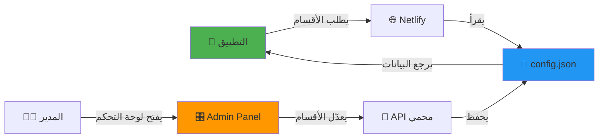

# 🎯 نظام التحكم عن بعد - دليل شامل


---

## 📦 ما تم إنشاؤه

```
feature-control-server/
│
├── 📄 config.json                    # ملف الإعدادات (الأقسام + كلمة السر)
├── 📄 package.json                   # معلومات المشروع
├── 📄 netlify.toml                   # إعدادات Netlify
├── 📄 .gitignore                     # الملفات المستبعدة من Git
│
├── 📁 public/
│   └── 📄 index.html                 # لوحة التحكم (الواجهة)
│
├── 📁 netlify/functions/
│   ├── 📄 get-features.js            # API لقراءة الأقسام
│   └── 📄 update-features.js         # API لتحديث الأقسام
│
├── 📘 README.md                      # معلومات عامة
├── 📘 DEPLOY_GUIDE.md                # دليل النشر الكامل
└├── 📘 remote_feature_control.dart    # كود الربط مع Flutter
```

---

## ⚡ البدء السريع

### 🚀 خطوات بسيطة:

```bash
# 1. افتح المجلد
cd C:\Users\user\Music\jos\test7\feature-control-server

# 2. انشئ Git Repository
git init
git add .
git commit -m "Initial commit"

# 3. ارفع على GitHub
# (اتبع التعليمات في DEPLOY_GUIDE.md)

# 4. انشر على Netlify
# (اختر الـ repo من netlify.com)
```

---

## 🎛️ الأقسام القابلة للتحكم

| القسم | المفتاح | الوصف |
|-------|---------|-------|
| 🎤 **الغرف الصوتية** | `voiceRooms` | غرف المحادثة الصوتية |
| 👥 **القبائل** | `tribes` | نظام القبائل والمنافسات |
| 📿 **أذكاري** | `adhkar` | قسم الأذكار والأدعية |
| 📝 **الاختبارات** | `quizzes` | الاختبارات والمسابقات |

---

## 🔐 الأمان

- ✅ كلمة سر محمية
- ✅ API عام لا يكشف كلمة السر
- ✅ API خاص للتحديث (محمي بكلمة سر)
- ✅ CORS مفعّل للوصول من التطبيق

**كلمة السر الافتراضية:** `admin123`  
**⚠️ يُنصح بتغييرها بعد النشر!**

---

## 📡 API Endpoints

### 1️⃣ قراءة الأقسام (عام - لا يحتاج كلمة سر)
```http
GET /api/get-features
```

**Response:**
```json
{
  "features": {
    "voiceRooms": true,
    "tribes": true,
    "adhkar": true,
    "quizzes": true
  },
  "lastUpdated": "2026-02-02T19:43:24+03:00"
}
```

### 2️⃣ تحديث الأقسام (خاص - يحتاج كلمة سر)
```http
POST /api/update-features
Content-Type: application/json

{
  "password": "admin123",
  "features": {
    "voiceRooms": false,
    "tribes": true,
    "adhkar": true,
    "quizzes": true
  }
}
```

**Response:**
```json
{
  "success": true,
  "message": "تم التحديث بنجاح",
  "features": { ... }
}
```

---

## 🎨 استخدام في Flutter

### الكود البسيط:

```dart
import 'remote_feature_control.dart';

// في أي مكان في التطبيق:
final features = await RemoteFeatureControl.getFeatures();

// تحقق من قسم معين
if (features['voiceRooms'] == true) {
  // أظهر الغرف الصوتية
  Navigator.push(context, MaterialPageRoute(
    builder: (context) => VoiceRoomsPage(),
  ));
} else {
  // القسم معطّل
  showDialog(
    context: context,
    builder: (context) => AlertDialog(
      title: Text('القسم معطّل مؤقتاً'),
    ),
  );
}
```

### استخدام مع FutureBuilder:

```dart
FutureBuilder<bool>(
  future: RemoteFeatureControl.isFeatureEnabled('tribes'),
  builder: (context, snapshot) {
    if (snapshot.data == true) {
      return TribesSection(); // أظهر القبائل
    }
    return SizedBox.shrink(); // أخفِها
  },
)
```

---

## ➕ إضافة أقسام جديدة

### 1. عدّل `config.json`:
```json
{
  "features": {
    "voiceRooms": true,
    "tribes": true,
    "adhkar": true,
    "quizzes": true,
    "news": true,        // ✨ جديد
    "challenges": true   // ✨ جديد
  }
}
```

### 2. عدّل `public/index.html` في قسم `featureNames`:
```javascript
const featureNames = {
    voiceRooms: { name: 'الغرف الصوتية', desc: 'غرف المحادثة الصوتية' },
    tribes: { name: 'القبائل', desc: 'نظام القبائل والمنافسات' },
    adhkar: { name: 'أذكاري', desc: 'قسم الأذكار والأدعية' },
    quizzes: { name: 'الاختبارات', desc: 'الاختبارات والمسابقات' },
    news: { name: 'الأخبار', desc: 'آخر الأخبار' },          // ✨ جديد
    challenges: { name: 'التحديات', desc: 'التحديات اليومية' } // ✨ جديد
};
```

### 3. في Flutter:
```dart
if (features['news'] == true) {
  // أظهر قسم الأخبار
}
```

---

## 🔄 كيفية العمل



---

## ✅ المميزات

- ⚡ **فوري**: التغييرات تطبّق فوراً بدون تحديث APK
- 🎯 **بسيط**: واجهة سهلة الاستخدام
- 🔒 **آمن**: محمي بكلمة سر
- 🌐 **سريع**: يعمل على Netlify CDN
- 📱 **متجاوب**: يعمل على الجوال والكمبيوتر
- 🆓 **مجاني**: مستضاف على Netlify مجاناً

---

## 📞 الدعم

في حال واجهت أي مشكلة:
1. تأكد أن الرابط صحيح في Flutter
2. تأكد أن كلمة السر صحيحة
3. راجع [DEPLOY_GUIDE.md](file:///c:/Users/user/Music/jos/test7/feature-control-server/DEPLOY_GUIDE.md)

---

## 🎉 جاهز!

**السيرفر جاهز 100% للنشر!**

**الخطوة التالية:** اتبع [DEPLOY_GUIDE.md](file:///c:/Users/user/Music/jos/test7/feature-control-server/DEPLOY_GUIDE.md) لنشره على GitHub و Netlify!

---

**صنع بـ ❤️ للتحكم الذكي في التطبيقات**
