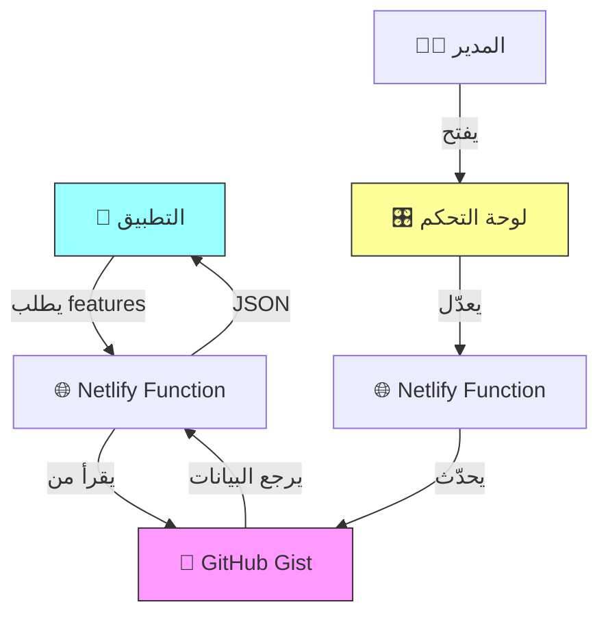

# 🎛️ سيرفر التحكم عن بعد - النسخة النهائية

## 🌟 المميزات

- ✅ **يعمل بالكامل على Netlify**
- ✅ **لوحة تحكم احترافية**
- ✅ **قاعدة بيانات على GitHub Gist**
- ✅ **تحديثات فورية**
- ✅ **آمن ومحمي بكلمة سر**

---

## 📦 هيكل المشروع

```
feature-control-server/
│
├── 📄 config.json                    # مثال للتكوين (للمرجعية فقط)
├── 📄 package.json
├── 📄 netlify.toml
├── 📄 .gitignore
│
├── 📁 public/
│   └── 📄 index.html                 # لوحة التحكم
│
├── 📁 netlify/functions/
│   ├── 📄 get-features.js            # قراءة من GitHub Gist
│   └── 📄 update-features.js         # تحديث GitHub Gist
│
├── 📘 remote_feature_control.dart    # كود الربط مع Flutter
├── 📘 DEPLOY_GUIDE.md                # دليل النشر الكامل ⭐
└── 📘 README.md
```

---

## 🚀 البدء السريع

### دليل النشر الكامل موجود في:
**[DEPLOY_GUIDE.md](file:///c:/Users/user/Music/jos/test7/feature-control-server/DEPLOY_GUIDE.md)**

### الخطوات بإيجاز:
1. أنشئ GitHub Gist بملف `config.json`
2. أنشئ GitHub Personal Access Token
3. ارفع المشروع على GitHub
4. انشر على Netlify
5. أضف Environment Variables (TOKEN + GIST_ID)
6. اختبر لوحة التحكم!

---

## 🎯 كيف يعمل؟



---

## 🔐 الأمان

- ✅ GitHub Token محفوظ في Environment Variables فقط
- ✅ كلمة السر لا تظهر في API العام
- ✅ Gist يمكن أن يكون سري (Secret)
- ✅ CORS مفعّل للتطبيق فقط

---

## 📡 API Endpoints

### قراءة الأقسام (عام)
```http
GET /api/get-features
```

**Response:**
```json
{
  "features": {
    "voiceRooms": true,
    "tribes": true,
    "adhkar": true,
    "quizzes": true
  },
  "lastUpdated": "2026-02-02T...",
  "source": "github-gist"
}
```

### تحديث الأقسام (محمي)
```http
POST /api/update-features
Content-Type: application/json

{
  "password": "admin123",
  "features": {
    "voiceRooms": false,
    ...
  }
}
```

---

## 📱 استخدام في Flutter

```dart
import 'remote_feature_control.dart';

// قراءة جميع الأقسام
final features = await RemoteFeatureControl.getFeatures();

// فحص قسم معين
bool enabled = await RemoteFeatureControl.isFeatureEnabled('voiceRooms');

// استخدام
if (features['voiceRooms'] == true) {
  Navigator.push(context, 
    MaterialPageRoute(builder: (_) => VoiceRoomsPage())
  );
}
```

---

## ➕ إضافة أقسام جديدة

### 1. عدّل الـ Gist على GitHub:
```json
{
  "features": {
    "voiceRooms": true,
    "tribes": true,
    "adhkar": true,
    "quizzes": true,
    "news": true,        // ✨ جديد
    "challenges": true   // ✨ جديد
  }
}
```

### 2. عدّل `public/index.html` (اختياري - للعرض بالعربية):
```javascript
const featureNames = {
    // ... الموجود
    news: { name: 'الأخبار', desc: 'آخر الأخبار' },
    challenges: { name: 'التحديات', desc: 'التحديات اليومية' }
};
```

---

## 💡 نصائح

- 🔄 **Fallback تلقائي**: إذا تعطل Gist، تُستخدم القيم الافتراضية
- ⚡ **سريع**: GitHub Gist API سريع جداً
- 🆓 **مجاني**: كل شيء مجاني 100%
- 🔒 **آمن**: Token لا يظهر أبداً في الكود

---

## 📞 الدعم

**اقرأ الدليل الكامل:** [DEPLOY_GUIDE.md](file:///c:/Users/user/Music/jos/test7/feature-control-server/DEPLOY_GUIDE.md)

---

**صُنع بـ ❤️ للتحكم الذكي بالتطبيقات**
